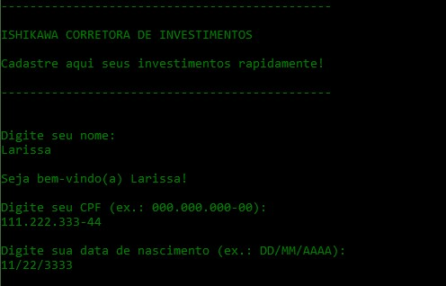

# PERSONAL PROJECT
#### OBJECT ORIENTED PROGRAMMING CLASS
Final project of the Object-Oriented Programming course taught by Professor Dr. José Antonio Gonçalves, in the undergraduate program in Systems Analysis and Development at the Federal Technological University of Paraná, Cornélio Procópio campus.

### Class diagram of the project

### First impression of the program

## Technologies and Tools
- Java
- Canva

### Do you have any feedbacks?
Please contact me! :D

- [E-mail](mailto:l.ishikawacunha@gmail.com)
- [Linkedin](https://www.linkedin.com/in/larissaishikawacunha/)
- [GitHub](https://github.com/larissaiishikawa)  

###### Made with 🤍 by [LARISSA ISHIKAWA](https://github.com/larissaiishikawa)
