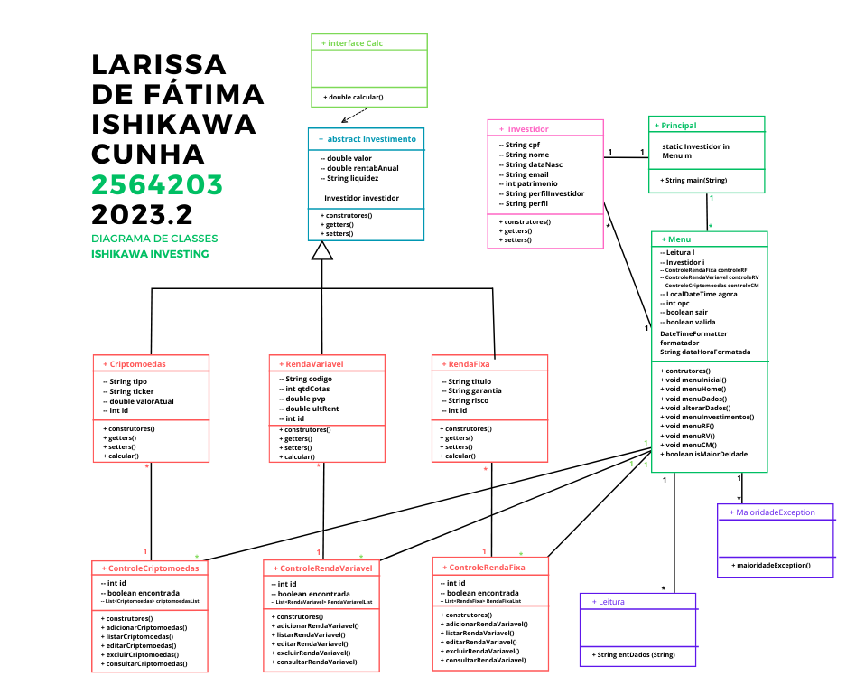

# Regras de Negócio - Ishikawa Investing 💵

- **RN1**: O sistema simula uma corretora de investimentos, a qual possibilita o cadastro dos ativos de um investidor de maneira simples.  

- ✅ **RN2**: Inicialmente, aparecerá um menu com as opções “Entrar” e “Cadastre-se”
    - **RN2.1**: Caso o usuário opte por cadastrar-se, ele fará seu cadastro completo
    - **RN2.2**: Caso opte por logar, ele apenas precisará digitar seu CPF e nome

- ✅ **RN3**: Um menu da “tela inicial” será apresentado, com as opções: 1 - Investimentos; 2 - Meus dados (ali, o usuário que inicialmente optou por apenas entrar, poderá concluir seu cadastro, e o usuário já cadastrado poderá consultar e alterar suas informações); e 3 - Sair (encerra o programa).  

- **RN4**: No menu Investimentos (feito com base em List/ArrayList) o usuário terá as seguintes ações: 1 - Cadastrar novo investimento; 2 - Listar investimentos; 3 - Consultar investimento; 4 - Alterar investimento; 5 - Remover investimento; 6 - Início;
    - **RN4.1**: Em Cadastrar novo investimento, de acordo com o diagrama, o usuário poderá escolher cadastrar entre 3 tipos de ativos (Renda fixa, Renda variável e Criptomoedas), ele deverá preencher os seguintes dados (herdados pela classe-mãe Investimento): Valor, Rentabilidade Anual e Liquidez
        - **RN4.1.1**: Ao escolher Renda Fixa, o usuário deverá preencher os dados: Titulo, Garantia e Risco; A interface Calc retornará o valor da Rentabilidade mensal em relação ao Valor e Rentabilidade cadastrados.
        - **RN4.1.2**: Ao escolher Renda Variável, o usuário deverá preencher os dados: Código, Quantidade de cotas, P/VP e Última rentabilidade; A interface Calc retornará o valor pago por Cotas em relação ao Valor cadastrado.
        - **RN4.1.3**: Ao escolher Criptomoedas, o usuário deverá preencher os dados: Tipo, Ticker e Valor atual. A interface Calc retornará o valor da fração adquirida do Criptoativo em relação ao Valor cadastrado.  

- ✅ **RN5**: No menu Meus dados, serão apresentados os dados do usuário (caso esteja cadastrado) e terá as seguintes ações: 1 - Alterar dados; 2 - Início.

-----------------------------------------

### Diagrama de classes 📈 --> a ajustar de acordo com Regras de Negócio

